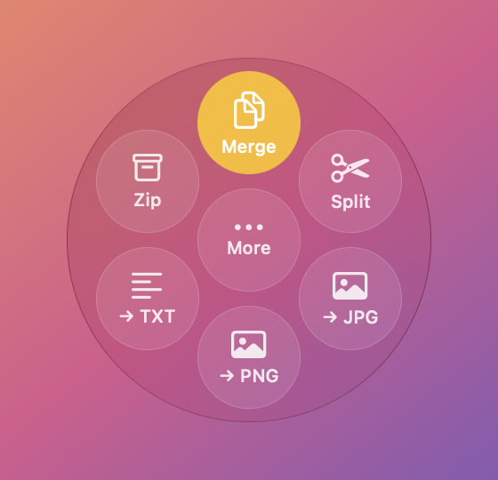
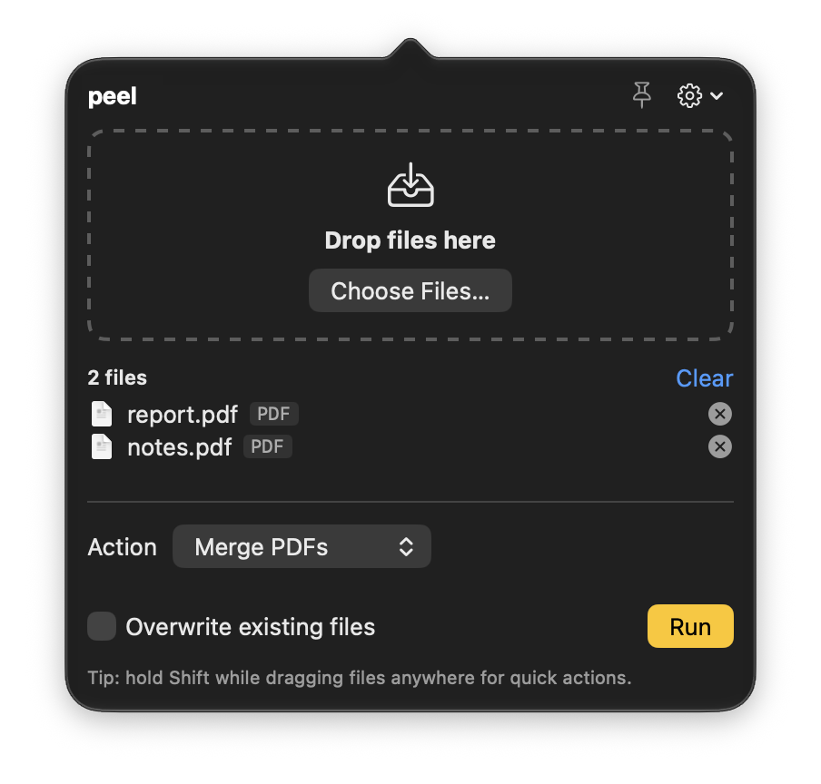

# peel

**A free, open-source file converter and toolkit for macOS that never uploads anything.**
Convert images, PDFs, audio/video, subtitles and archives — from a Shift-drag wheel, a menu-bar
panel, Finder's right-click menu, or the terminal.

<p align="center">
  
  &nbsp;&nbsp;
  
</p>

## What it does

- **Shift-drag wheel** — drag files anywhere, hold Shift, drop on an action (Merge, Split, → JPG,
  Compress, GIF, Extract, Zip…). The wheel shows only what fits the files you're dragging.
- **Menu-bar panel** — everything else, with options: page ranges, sizes, quality, trim times.
- **Finder Quick Actions** — right-click → Convert To…, Merge PDFs, Split PDF, Extract Here, Zip.
- **A complete CLI** — every feature, scriptable (`peel convert`, `peel pdf …`, `peel media …`).
- **PDF tools** — merge, split, extract, delete, rotate, reorder, text, info; links and bookmarks
  follow their pages.
- **Images** — JPG, PNG, HEIC, TIFF, BMP, GIF, WebP, AVIF, SVG in; resize and quality control;
  EXIF orientation and wide-gamut colour kept.
- **Audio & video** — convert between MP4/MOV/MKV/WebM/AVI/WMV and MP3/M4A/WAV/FLAC/OGG/Opus/AIFF,
  trim, compress (optionally to a target size), make GIFs, extract audio.
- **Subtitles** — SRT ↔ VTT ↔ TXT. **Archives** — extract zip/tar/gz/bz2/xz/rar/7z, create zip/tar.gz.
- **Safe by default** — never overwrites your originals, writes atomically, Ctrl-C leaves nothing
  half-done, and every missing optional tool is explained with the exact `brew install` command.

## Install

Requires macOS 13+ and Xcode or the Swift command-line tools.

```bash
git clone https://github.com/00mkp/peel.git && cd peel
./install.sh     # CLI → ~/.local/bin, Finder Quick Actions, and ~/Applications/Peel.app
                 # (override with PREFIX=/usr/local ./install.sh or APP_DIR=/Applications ./install.sh)
```

Optional extras unlock more formats — `peel doctor` shows what's installed:

```bash
brew install ffmpeg webp libavif unar librsvg
```

| Tool | Unlocks |
|---|---|
| ffmpeg | video/audio conversion, trim, compress, GIF |
| webp / libavif | WebP / AVIF output |
| unar | RAR and 7z extraction |
| librsvg | SVG input |

PDF tools, JPG/PNG/HEIC/TIFF/BMP/GIF images, subtitles, zip and tar need nothing extra.

## Command line

Every feature is a command; `peel --help` and `peel <command> --help` list all options.


```bash
# Convert (format detected automatically)
peel convert IMG_0412.HEIC --to jpg
peel convert *.png --to webp --quality 80 --width 1600
peel convert scan.pdf --to png --dpi 150          # one image per page
peel convert a.jpg b.jpg c.jpg --to pdf           # one combined PDF
peel convert talk.mov --to mp4
peel convert subs.srt --to vtt

# PDFs
peel pdf merge a.pdf b.pdf c.pdf -o combined.pdf
peel pdf split big.pdf                            # one file per page
peel pdf split big.pdf --pages 1-3,7-9            # one file per range
peel pdf extract big.pdf --pages 2-5
peel pdf delete big.pdf --pages 4,6
peel pdf rotate big.pdf --by 90 --pages 1,3
peel pdf reorder big.pdf --order 3,1,2,4-
peel pdf text big.pdf
peel pdf info big.pdf

# Media (ffmpeg)
peel media trim clip.mp4 --from 0:10 --to 0:45
peel media compress clip.mov --size 25MB
peel media audio clip.mp4 --to mp3
peel media gif clip.mp4 --fps 12 --width 480

# Archives
peel x anything.zip                               # also tar.gz, tar.xz, gz, rar, 7z
peel zip folder/ notes.txt -o bundle.zip

# Help
peel formats photo.heic                           # what can this become?
peel doctor
```

## Managing peel

```
peel status                 version, install source, Quick Actions, app, Open at Login, tools
peel update                 pull the latest source, rebuild, reinstall (CLI, Quick Actions, app)
peel update <dir|archive>   update from a directory or .tar.gz/.tgz/.zip instead
peel uninstall              remove the app (and its login item), Quick Actions, the CLI and settings
peel app start|stop         launch or quit the menu-bar app
peel app panel              open the menu-bar panel
peel app login on|off       Open at Login
```

Cloning is worth preferring over an archive: `install.sh` records where it ran from, so a clone
gives you a working `peel update` afterwards. Everything the app does is also a `peel` command — the
app and the CLI share the same engine.

## Finder Quick Actions

`./install.sh` adds these to Finder's right-click menu (Quick Actions / Services):
**Peel - Convert To…**, **Merge PDFs**, **Split PDF**, **Extract Here**, **Zip**.
Results appear as notifications; problems (including a missing optional tool, with the exact
`brew install` command) appear as dialogs. Manage them with:

```bash
peel install-quick-actions
peel uninstall-quick-actions
```

## Peel.app

`./install.sh` also builds `~/Applications/Peel.app` (or run `scripts/build-app.sh`; set `APP_DIR`
to install elsewhere). Peel lives only in the menu bar — look for the peel-twist icon. There is no
window and no Dock icon.

- **Action wheel:** select files in Finder (or anywhere), start dragging, and hold **Shift** — a
  wheel of quick actions appears at the cursor (Merge, Split, → JPG, Compress, GIF, Extract, Zip…,
  depending on the files). Drop on one to run it; a notification tells you the result. Drop on
  **More…** to open the files in the menu-bar panel instead.
- **Menu-bar panel:** click the icon, then drop files into the panel (or use **Choose Files…**). Pick
  an action, set options (pages, sizes, formats…), press Run. The **pin** keeps the panel open while
  you drag files in from Finder.
- The **gear** has **Settings…** (optional tools, **Open at Login**) and **Quit Peel**.
- "Open With → Peel" or opening Peel again also opens the panel.
- The first time, macOS may ask to allow Peel's notifications and, for the wheel, to let Peel read
  what's being dragged. Actions that need a tool you don't have are listed separately with the
  install command; Peel re-checks whenever you come back to it.

## Behaviour

- Output goes next to the input unless you pass `-o` (a file, or a folder — end it with `/`).
- Existing files are never overwritten: you get `name 2.ext`. `--force` overwrites, but never an input.
- Batches keep going when one file fails; the exit code is `1` if anything failed, `2` for usage errors.
- Page ranges: `3`, `1-3,5`, `8-` (to the end), `5-3` (backwards).
- PDF bookmarks carry over: merged files get one bookmark per original file (with its own bookmarks
  inside), and split/extract/reorder keep the bookmarks for the pages they keep.
- Ctrl-C stops cleanly and leaves no half-written files.
- Set PEEL_TOOL_PATH (colon-separated folders) to control where peel looks for optional tools.

## Development

```bash
swift build
scripts/test.sh          # runs the tests (use this rather than bare `swift test`: with only the
                         # Command Line Tools installed, `swift test` silently runs no tests)
```

## License

MIT — see [LICENSE](LICENSE).
